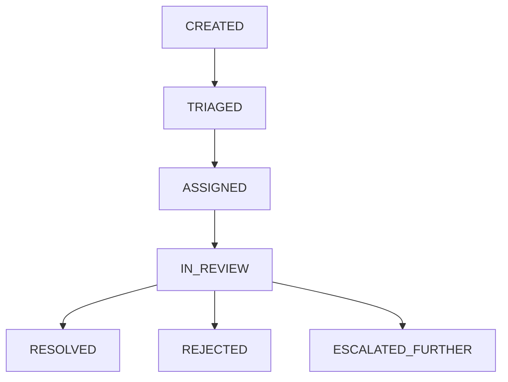

# JNPI Workflow Service (Core Ticketing & State Machine)

[](https://fastapi.tiangolo.com)
[](https://www.postgresql.org/)
[](https://www.python.org/)
[](https://www.docker.com/)

The **Core Ticketing & State Machine** subsystem (`workflow-service`) for the Jordan National Policy Intelligence Platform (JNPI). This service manages the strict, stateful lifecycle of human-in-the-loop (HITL) escalations from the agent service within the JNPI platform.

It is designed as the sync, stateful, transactional backbone of the JNPI HITL lifecycle, ensuring zero data loss, strict state transitions, and immutable audit logging.

## Features

- **Strict Finite State Machine (FSM)**: Enforces valid ticket transitions (`CREATED` -> `TRIAGED` -> `ASSIGNED` -> `IN_REVIEW` -> `RESOLVED` / `REJECTED` / `ESCALATED_FURTHER`).
- **Immutable Audit Logging**: Every transaction, field change, and state transition is immutably logged for governance.
- **RESTful CRUD APIs**: Comprehensive endpoints for ticket management, escalation, resolution, and auditing.
- **Robust Validation**: Uses strictly enforced Pydantic schemas.
- **Transactional Integrity**: SQLAlchemy sessions manage complex operations atomically to prevent partial database updates.
- **Dockerized**: Ready for containerized deployment.

## Architecture

- **Framework**: FastAPI (Python 3.11)
- **Database**: PostgreSQL (Strict requirement)
- **ORM & Migrations**: SQLAlchemy 2.0 & Alembic
- **Patterns**: Layered Architecture, Strict FSM, Immutable Audit Logging

## Prerequisites

- **Python 3.11+**
- **PostgreSQL**
- **Docker** & **Docker Compose** (optional, for easy containerization)

## Setup & Local Development

### 1. Clone the repository

```bash
git clone <repository_url>
cd workflow-service
```

### 2. Configure Environment Variables

Copy the provided example environment file and configure your local DB connection and other settings:

```bash
cp .env.example .env
```
Ensure your database credentials and connection strings are correctly set in the `.env` file.

### 3. Local Setup (Without Docker)

Create a virtual environment and install dependencies:

```bash
python -m venv venv

# On Windows (cmd or terminal)
venv\Scripts\activate
# On Unix/macOS
source venv/bin/activate

pip install -r requirements.txt
```

Run database migrations:

```bash
alembic upgrade head
```

Start the application:

```bash
uvicorn app.main:app --reload
```

The server will be available at `http://localhost:8000`. You can view the interactive OpenAPI documentation automatically generated by FastAPI at `http://localhost:8000/docs`.

### 4. Running with Docker

You can optionally build and run the service using Docker.

```bash
docker build -t jnpi-workflow-service .
docker run -p 8000:8000 --env-file .env jnpi-workflow-service
```
*Note: Depending on networking setup, you will need to assure the Docker container can access your PostgreSQL instance correctly (using `host.docker.internal` or via Docker Compose network setup).*

## Testing

The project uses `pytest` and automatically operates using an isolated SQLite database for its unit and integration testing suite.

```bash
pytest tests/
```

## API Endpoints Overview

The complete OpenAPI specification is explorable via the Swagger UI available at `/docs` when the app is running. Here is a summary of the core interfaces:

### Tickets
- **`POST /tickets`**: Create a ticket. (Expected format dictated by Team 2 - Agent Service payload). Idempotent.
- **`GET /tickets`**: Pagination & filterable list of tickets.
- **`GET /tickets/{id}`**: Retrieve a specific ticket.
- **`PATCH /tickets/{id}`**: Update ticket details (e.g., assign users).

### Sub-orchestrations
- **`POST /escalate`**: Step a ticket through strict internal states.
- **`POST /resolve`**: Resolve a ticket (triggers stubbed downstream webhooks/events).

### Audit & System
- **`GET /audit`**: Query raw audit representations designed for Team 3 (Governance) processing.
- **`GET /health`**: Health check endpoint verifying DB connection status (`SELECT 1`).

## State Machine Flows

The FSM guarantees that tickets only sequence linearly through allowed lifecycle states. Invalid transitions will inherently throw strict `409 Conflict` HTTP responses.


